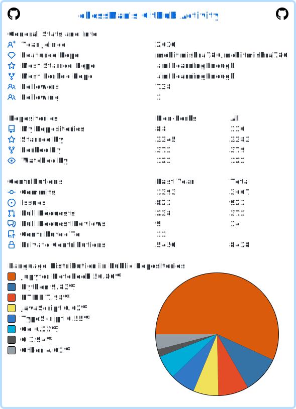
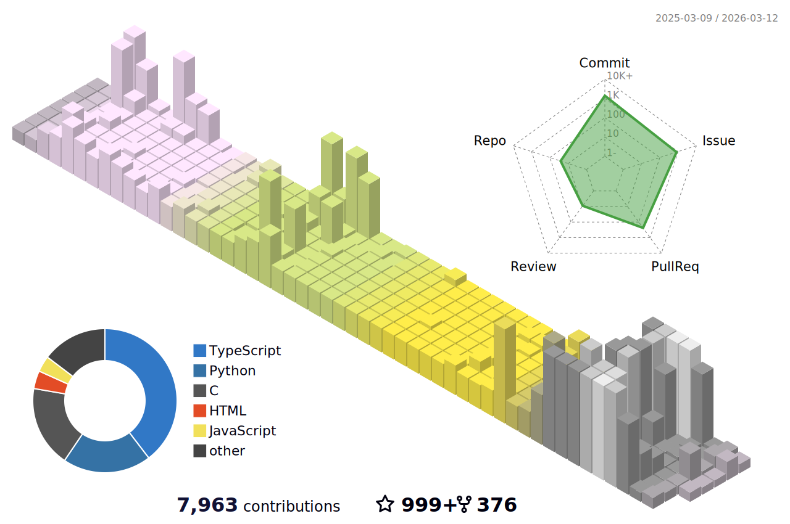

<!-- Header with Wave Animation -->

<!-- Typing Animation -->

  

<!-- Social Badges -->

  
  
  
  

---

## About Me

Systems Programmer deeply passionate about low-level engineering, performance optimization, and building robust system architectures from the ground up.

- Currently building experimental system software
- Deep diving into Compiler design and experimental OS kernels
- Ask me about Operating Systems, Kernel Internals, MLOps, HPC
- Fun fact: I spend more time with binary dumps than people

---

## Tech Stack

  

---

## GitHub Analytics

  

 

  <table border="0">
    <tr>
      <td width="50%"></td>
      <td width="50%"></td>
    </tr>
    <tr>
      <td width="50%"></td>
      <td width="50%"></td>
    </tr>
    <tr>
      <td colspan="2" align="center">
        
      </td>
    </tr>
  </table>

  

---

## GitHub Trophies

  

---

## Lines of Code Statistics

<!--START_LOC-->
## Lines of Code Statistics

| Language | Files | Lines | Code | Comments | Blanks |
|----------|-------|-------|------|----------|--------|
| SVG | 8 | 68 | 67 | 0 | 1 |
| YAML | 6 | 374 | 316 | 10 | 48 |
| Markdown | 1 | 165 | 119 | 0 | 46 |
| Plain Text | 1 | 1 | 1 | 0 | 0 |
| Total | 16 | 608 | 503 | 10 | 95 |
| **Total** | **16** | **608** | **503** | **10** | **95** |

<!--END_LOC-->

---

## 3D Contribution Graph

  

---

## Contribution Snake

  

---

## Latest Blog Posts

<!-- BLOG-POST-LIST:START -->
- [2025 Database Upgrades Recap: Real Code Walkthroughs, Query Hacks, and Setup Tips from This Year&#39;s Big Releases](https://mohitmishra786.github.io/TheCoreDump/posts/2025-Database-Upgrades-A-Comprehensive-Breakdown-of-Core-Features-Query-Optimizations-and-Deployment-Strategies/)
- [HTTP Message Size Handling: Content-Length and Chunked Transfer Encoding](https://mohitmishra786.github.io/TheCoreDump/posts/Handling-HTTP-Message-Sizes-Content-Length-vs-Chunked-Encoding-in-Modern-Web-Architectures/)
- [Turbocharging Your Code: A No-BS Guide to Software Prefetching in C](https://mohitmishra786687.medium.com/turbocharging-your-code-a-no-bs-guide-to-software-prefetching-in-c-7db1abacd92f?source=rss-678bb511886d------2)
- [Microsoft Azure Front Door Part 5: Integration, Monitoring, and Best Practices](https://mohitmishra786.github.io/TheCoreDump/posts/Microsoft-Azure-Front-Door-Part-5-Integration-Monitoring-and-Best-Practices/)
- [Microsoft Azure Front Door Part 4: Security and Performance Optimization](https://mohitmishra786.github.io/TheCoreDump/posts/Microsoft-Azure-Front-Door-Part-4-Security-and-Performance-Optimization/)<!-- BLOG-POST-LIST:END -->

---

## Connect With Me

  
  
  

---

  
  
   
  
  

  
<i>Last Updated: 2026-01-04</i>

<!-- LOC-STATS-START -->

**Last Updated:** 2026-01-04 00:10:25 UTC

 Detailed Statistics

# LOC Statistics - All Repositories

Generated on: 2026-01-04 00:02:53 UTC

## Summary Statistics

| Metric | Count |
|--------|-------|
| Total Repositories Processed | 147 |
| Failed Repositories | 0 |
| Total Files | 24,212 |
| Total Lines of Code | 23,620,328 |
| Total Blank Lines | 1,798,401 |
| Total Comment Lines | 13,536,358 |

## Top 15 Languages by LOC

| Language | Files | Code Lines | Comment Lines | Blank Lines |
|----------|-------|------------|---------------|-------------|
| Jupyter Notebook |    866 |   13190713 |      13190713 |           0 |
| HTML         |   1591 |      84195 |         84195 |      313755 |
| JavaScript   |   1490 |      47790 |         47790 |       25882 |
| TypeScript   |    509 |      45044 |         45044 |        9505 |
| C/C++ Header |    524 |      36397 |         36397 |       18827 |
| Ruby         |   1342 |      33148 |         33148 |       23085 |
| C++          |    993 |      31789 |         31789 |       27471 |
| Python       |    850 |      20830 |         20830 |       18408 |
| C            |    582 |      14100 |         14100 |       18877 |
| Go           |    360 |       7622 |          7622 |       11152 |
| Assembly     |     57 |       5267 |          5267 |        2616 |
| Java         |     67 |       4133 |          4133 |        1712 |
| YAML         |    443 |       2256 |          2256 |        2423 |
| CSS          |    103 |       1667 |          1667 |       13377 |
| Markdown     |   4498 |       1611 |          1611 |      102877 |

## Top 20 Repositories by LOC

| Repository | Lines of Code |
|------------|---------------|
| mohitmishra786/covid-19-data                       |       6385160 |
| OmdenaAI/ACAPS                                     |       5601384 |
| OmdenaAI/Berlin-Chapter-Challenge-Waste-Management |       2979440 |
| mohitmishra786/meshery                             |       1650694 |
| OmdenaAI/omdena-bangladesh-market-place            |        971598 |
| OmdenaAI/latam-chapters-news-detector              |        958890 |
| mohitmishra786/Natural-Language-Processing-Specialization |        541573 |
| mohitmishra786/py                                  |        522687 |
| OmdenaAI/dhaka-bangladesh-real-estate-recommendation |        477093 |
| OmdenaAI/omdena-texas-homelessness                 |        404748 |
| mohitmishra786/Homelessness-in-Texas               |        404740 |
| mohitmishra786/chessman                            |        290280 |
| mohitmishra786/bustub-private                      |        276102 |
| mohitmishra786/Smart-Health                        |        227712 |
| mohitmishra786/REST-API                            |        208637 |
| mohitmishra786/Sales_Data_Analysis                 |        186979 |
| OmdenaAI/omdena-france-flu-dashboard               |        165396 |
| OmdenaAI/omdena-india-roadsafety                   |        143114 |
| mohitmishra786/Of-Genomes-And-Genetics---HackerEarth-ML |        116724 |
| OmdenaAI/lagos-chapter-water-availability          |        101722 |

<!-- LOC-STATS-END -->
