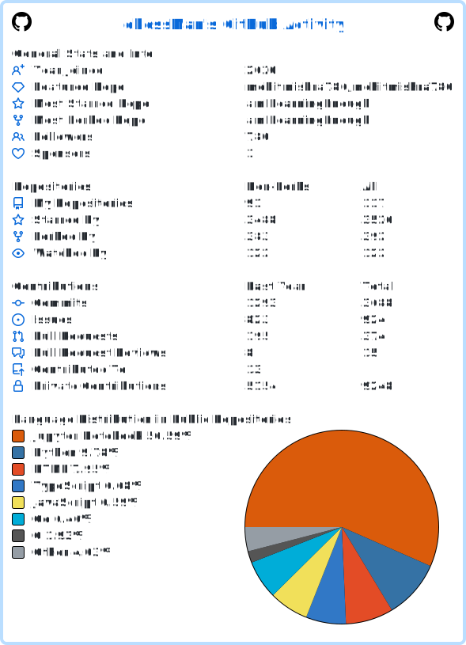
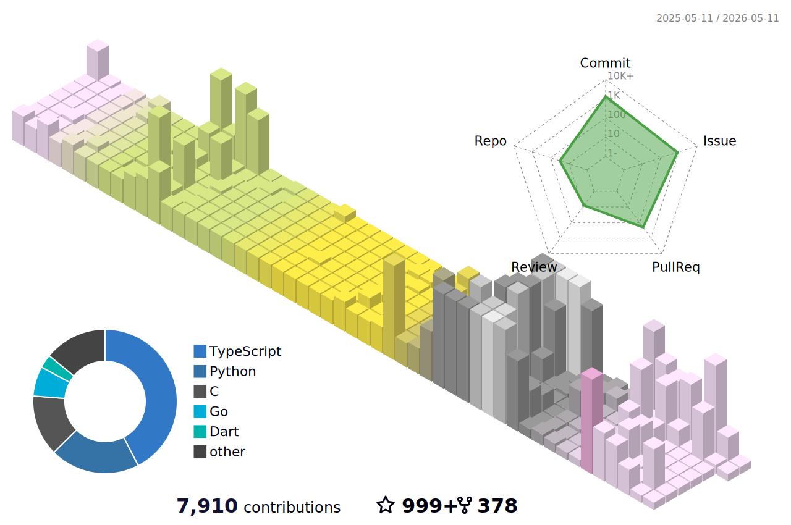

<!-- Header with Wave Animation -->

<!-- Typing Animation -->

  

  
  
  
  
  

<!-- Stats Counter Badges - Moved to Top -->

  
  
  
  

---

## About Me

Systems Programmer deeply passionate about low-level engineering, performance optimization, and building robust system architectures from the ground up.

- Currently building experimental system software
- Deep diving into Compiler design and experimental OS kernels
- Ask me about Operating Systems, Kernel Internals, MLOps, HPC
- Fun fact: I spend more time with binary dumps than people

---

## Tech Stack

  

---

## GitHub Analytics

<!-- GitHub Stats Grid - Better Alignment -->

  <table>
    <tr>
      <td align="center">
        
      </td>
      <td align="center">
        
      </td>
    </tr>
    <tr>
      <td align="center">
        
      </td>
      <td align="center">
        
      </td>
    </tr>
  </table>

 

<!-- GitHub Streak Stats -->

  

 

<!-- Profile Details Card - Full Width -->

  

 

<!-- Activity Graph - Collapsible -->

  
<h3>📈 GitHub Activity Graph (Click to Expand)</h3>

  

    
  

 

<!-- Detailed GitHub Stats - Collapsible -->

  
<h3>📊 Detailed GitHub Statistics (Click to Expand)</h3>

  

    
  

---

## Lines of Code Statistics

<!--START_LOC-->
<!--END_LOC-->

---

## 3D Contribution Graph

  

---

## Contribution Snake

  

---

## Latest Blog Posts

<!-- BLOG-POST-LIST:START -->
- [AWS ME-CENTRAL-1 and ME-SOUTH-1: When War Came to the Cloud](https://mohitmishra786.github.io/TheCoreDump/posts/AWS-ME-CENTRAL1-Bahrain-Military-Strike-Outage-When-War-Came-to-the-Cloud/)
- [Cloudflare BYOIP BGP Withdrawal: When an Automated Script Erases Your Addresses](https://mohitmishra786.github.io/TheCoreDump/posts/Cloudflare-BYOIP-BGP-Withdrawal-When-an-Automated-Script-Erases-Your-Addresses/)
- [YouTube February 2026: When the Recommendation Engine Is the Product](https://mohitmishra786.github.io/TheCoreDump/posts/YouTube-February-2026-When-the-Recommendation-Engine-Is-the-Product/)
- [Root Cause Analysis: GitHub&#39;s February 2026 Service Disruptions](https://mohitmishra786.github.io/TheCoreDump/posts/Root-Cause-Analysis-GitHub's-February-2026-Service-Disruptions/)
- [AWS CloudFront DNS Failure: One CDN Layer, Twenty Platforms, Zero Warning](https://mohitmishra786.github.io/TheCoreDump/posts/AWS-CloudFront-DNS-Failure-One-CDN-Layer-Twenty-Platforms-Zero-Warning/)<!-- BLOG-POST-LIST:END -->

<!-- LOC-STATS-START -->

**Last Updated:** 2026-04-26 02:13:51 UTC

 Detailed Statistics

# LOC Statistics - All Repositories

Generated on: 2026-04-26 02:03:01 UTC

## Summary Statistics

| Metric | Count |
|--------|-------|
| Total Repositories Processed | 176 |
| Failed Repositories | 0 |
| Total Files | 86,248 |
| Total Lines of Code | 29,682,713 |
| Total Blank Lines | 2,531,566 |
| Total Comment Lines | 13,824,304 |

## Top 15 Languages by LOC

| Language | Files | Code Lines | Comment Lines | Blank Lines |
|----------|-------|------------|---------------|-------------|
| Jupyter Notebook |    758 |   13089396 |      13089396 |           0 |
| Nix          |  42784 |     144048 |        144048 |      427423 |
| diff         |   5080 |     122457 |        122457 |       23855 |
| TypeScript   |   4072 |      87201 |         87201 |       88178 |
| HTML         |   1622 |      84369 |         84369 |      314403 |
| Python       |   2244 |      63759 |         63759 |       65474 |
| JavaScript   |   1582 |      48963 |         48963 |       27022 |
| C/C++ Header |    552 |      36629 |         36629 |       18955 |
| Ruby         |   1360 |      33360 |         33360 |       23396 |
| C++          |   1003 |      31803 |         31803 |       27537 |
| Rust         |    226 |      19964 |         19964 |        9128 |
| C            |    672 |      14798 |         14798 |       20024 |
| Go           |    565 |       9207 |          9207 |       16450 |
| Bourne Shell |   1194 |       7760 |          7760 |       10613 |
| Assembly     |     57 |       5267 |          5267 |        2616 |

## Top 20 Repositories by LOC

| Repository | Lines of Code |
|------------|---------------|
| mohitmishra786/covid-19-data                       |       6385160 |
| OmdenaAI/ACAPS                                     |       5601384 |
| mohitmishra786/nixpkgs                             |       5072862 |
| OmdenaAI/Berlin-Chapter-Challenge-Waste-Management |       2979527 |
| mohitmishra786/meshery                             |       1650694 |
| OmdenaAI/omdena-bangladesh-market-place            |        971598 |
| OmdenaAI/latam-chapters-news-detector              |        958890 |
| mohitmishra786/opencode                            |        647950 |
| mohitmishra786/Natural-Language-Processing-Specialization |        541573 |
| OmdenaAI/dhaka-bangladesh-real-estate-recommendation |        477093 |
| OmdenaAI/omdena-texas-homelessness                 |        404748 |
| mohitmishra786/Homelessness-in-Texas               |        404740 |
| mohitmishra786/chessman                            |        290280 |
| mohitmishra786/bustub-private                      |        276102 |
| mohitmishra786/Smart-Health                        |        227712 |
| mohitmishra786/REST-API                            |        208637 |
| mohitmishra786/Sales_Data_Analysis                 |        186979 |
| OmdenaAI/omdena-france-flu-dashboard               |        165396 |
| mohitmishra786/build-distributed-systems           |        154212 |
| OmdenaAI/omdena-india-roadsafety                   |        143114 |

<!-- LOC-STATS-END -->
