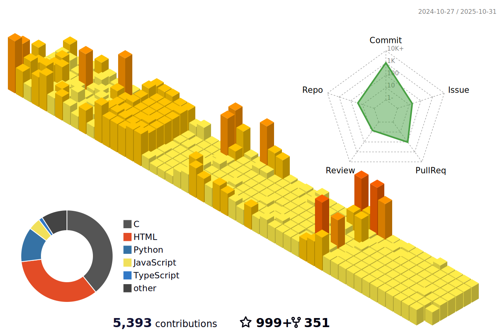

<h3 align="center">
  Welcome  to Mohit Mishra's profile!
  
</h3>


<!--

<p align="center">
  <a align="center" href="https://github.com/DenverCoder1/readme-typing-svg"></a>
</p>

## 🔔 𝙼𝚢 𝙻𝚊𝚝𝚎𝚜𝚝 𝙶𝚒𝚝𝙷𝚞𝚋 𝙼𝚎𝚝𝚛𝚒𝚌𝚜


<p>I am an Engineer, Learning to learn Low-Level Systems, and I also like to write blogs over <a href="https://medium.com/@mohitmishra786">Medium</a> </p>


<!-- Social badges section -->
<!-- Badges with custom icons - https://github.com/mohitmishra786/custom-icon-badges -->
<!-- View counter - https://github.com/mohitmishra786/Simple-View-Counter -->

## 🚀 About Me

I am an Engineer, Learning to learn Low-Level Systems. Most of my time is spent staring at a computer screen. During the day, I am usually ... leave it.

- 👋 Hi, I’m @mohitmishra786
- 👀 I’m interested in Low-Level System/ Machine Learning/ Statistics
- 🌱 I’m currently learning Compiler
- 💞️ I’m looking to collaborate on Projects
---

#### A little more about me
```javascript
const mohit = {
  code: ["C", "Javascript", "Python", "C++", "React.Js", "TyperScript", "Next.Js"],
  askMeAbout: ["Machine Learning","Deep Learning", "MLOps", "DevOps","Frontend Dev", "Python", "Flask" , "Competitive Programming", "MongoDB", "SQL",  "MySQL"],
  technologies: {
      frontend: ["HTML", "CSS", "JS", "Bootstrap", "React.JS", "Next.Js", "Tailwind CSS"],
      backend: ["Flask", "JS", "TyperScript", "MongoDB"],
  }
}
```

## 🛠 Skills

- **Programming :** Python (NumPy, Pandas, Scikit-learn, Matplotlib), C++, C, Java, JavaScript
- **Data Science :** Tensorflow, Keras, Algorithms, NLTK, Spark ML, Git, MLOps. MLFlow, Data Wrangling, Data Science,
Data Analysis, Modelling
- **Data Analytics :** ETL, Databases, Data Gathering, Analysis, Data Visualization, MySQL, Tableau
- **Cloud Technologies :** Amazon Web Services (AWS), Google Cloud (GCP), Azure, Heroku
- **Other :** Unit Testing, CI/CD Pipeline, Linux, Creativity, Probability and Statistics, Quantitative Analysis,Strong
Communication Skills, Research, Problem Solver, Independent, HTML, CSS, MySQL, Git, Pytorch, Image Classification,
Object Detection, Emotion Recognition, OpenCV, Image Processing, Docker

---

<!-- BLOG-POST-LIST:START -->
<!-- BLOG-POST-LIST:END -->

<div align="center">
    <a href="https://mohitmishra786.github.io/" target="_blank" title="GitHub metrics!">
        
    </a>
</div>

## 🔗 Links

<p align="center">

  <a href="https://twitter.com/chessMan786" target="_blank" rel="noopener noreferrer">
    
 </a>

  <a href="https://gitlab.com/mohitmishra786" target="_blank" rel="noopener noreferrer">
    
  </a>

  <a href="https://stackoverflow.com/users/9848114/duke786" target="_blank" rel="noopener noreferrer">
    
  </a>
  </br>
  <a href="https://www.linkedin.com/in/mohit-mishra-5b3492204/" target="_blank" rel="noopener noreferrer">
    
  </a>
  <a href="https://mohitmishra786687.medium.com/" target="_blank" rel="noopener noreferrer">
    
 </a>
 <a href="https://github.com/mohitmishra786" target="_blank" rel="noopener noreferrer">
    
 </a>
</p>

## &#x1f4c8; GitHub Stats

<p align="center">
    <a href="https://github.com/MartinHeinz/MartinHeinz">
        
    </a>
    <a href="https://github.com/MartinHeinz/MartinHeinz">
        
    </a>
</p>

## My Wakatime Stats
<!--START_SECTION:waka-->

```txt
Other   18 hrs 41 mins  ████████████████████████▓   99.28 %
SQL     8 mins          ▒░░░░░░░░░░░░░░░░░░░░░░░░   00.72 %
```

<!--END_SECTION:waka-->

---

<!-- https://github.com/anuraghazra/github-readme-stats -->

## Contribution Graph



<!-- [](https://github.com/mohitmishra786/github-readme-activity-graph)
 -->
